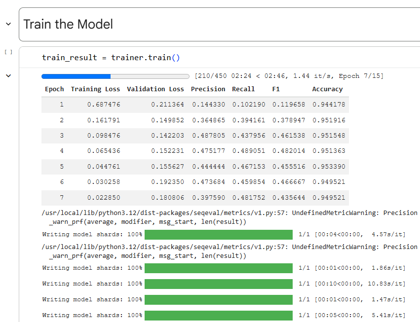
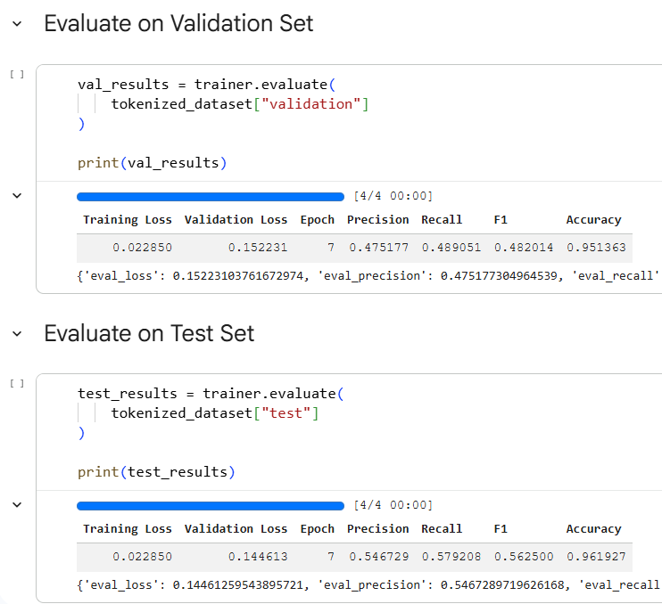
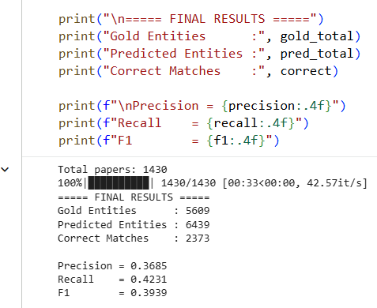
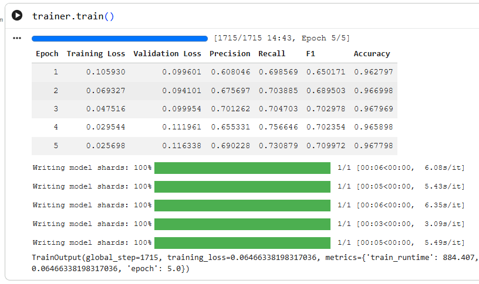
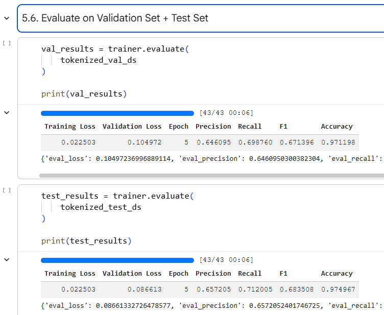
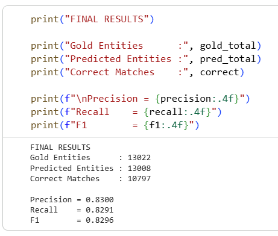

# Research Paper Analysis using NLP and Scientific NER

## Part 1 – NLP Pipeline


### Sample Outputs


## Part 2 – Scientific NER

A fine-tuned **SciBERT** model for extracting scientific entities from research paper abstracts.

## Overview
This project develops a Scientific Named Entity Recognition (NER) system by fine-tuning SciBERT on manually annotated research paper abstracts. The trained model identifies scientific entities such as **Algorithms, Datasets, Tasks, and Metrics** from research literature.


## Pipeline

```text
Research Paper Abstracts
        ↓
Manual Annotation
        ↓
BIO Label Conversion
        ↓
SciBERT Fine-tuning
        ↓
Evaluation
        ↓
Scientific Entity Extraction
```

---


## Initial Experiment

- Annotated Abstracts: **300**
- Model: **SciBERT**


## Initial Training





## Initial Evaluation





## Baseline Inference Results





---


## Dataset Expansion


- Annotated Abstracts: **3426**
- Fine-tuning Epochs: **5**

## Final Training




| Epoch | Precision | Recall | F1 |
|------:|----------:|-------:|---:|
|1|0.568|0.685|0.621|
|2|0.623|0.679|0.650|
|3|0.643|0.681|0.662|
|4|0.617|0.719|0.664|
|5|0.646|0.699|0.671|

---

## Final Evaluation




## Validation


```
Precision : 0.6461
Recall    : 0.6988
F1 Score  : 0.6714
Accuracy  : 0.9712
```

## Test

```
Precision : 0.6572
Recall    : 0.7120
F1 Score  : 0.6835
Accuracy  : 0.9750
```

---


## Final Inference Results




```
Precision : 0.8300
Recall    : 0.8291
F1 Score  : 0.8296
```

---

## Model Improvement

| Model | Training Data | F1 |
|------|--------------:|---:|
|Initial SciBERT|300|0.3939|
|Final SciBERT|3426|0.8296|

---

### Sample Outputs


## Tech Stack

- Python
- PyTorch
- Hugging Face Transformers
- SciBERT
- SentenceTransformers
- FAISS
- scikit-learn

---

## Repository Note

The fine-tuned SciBERT model and complete datasets are not included in this repository due to GitHub file size limitations.

## Repository Structure

```text
.
├── README.md
├── images/
├── Project-2 [Research Paper] Part-1.ipynb
└── Project-2 [Research Paper] Part-2 SciBERT NER.ipynb
```


## Notebook Overview

### Part 1 – NLP Pipeline

- Dataset Loading
- SentenceTransformer Embeddings
- FAISS-based Semantic Search
- Research Paper Summarization using BART
- Keyword Extraction
- Integrated Search + Summarization + Keyword Pipeline

### Part 2 – Scientific NER

- Manual Annotation
- BIO Label Conversion
- SciBERT Fine-tuning
- Model Evaluation
- Large-scale Entity Extraction